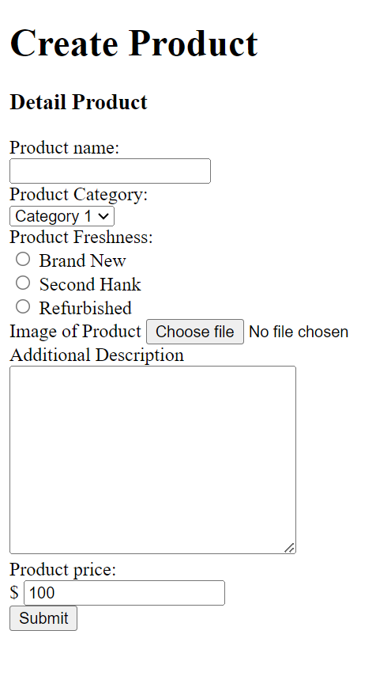
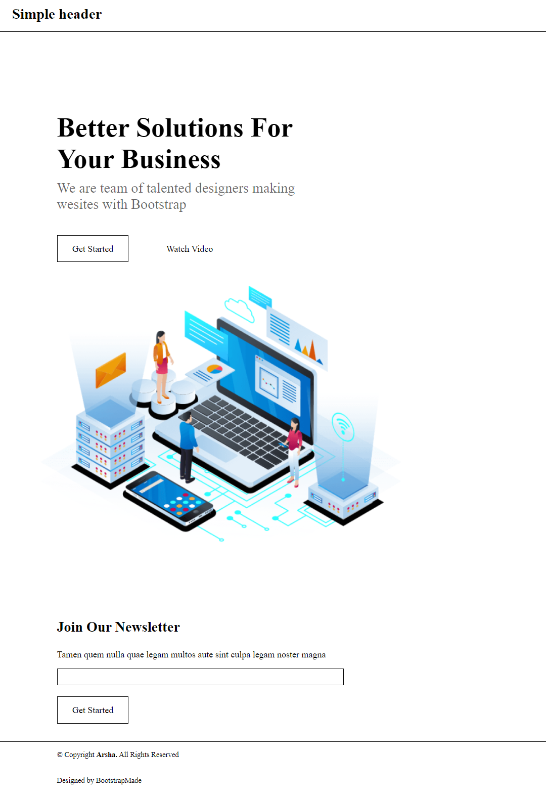
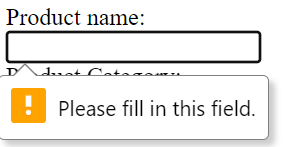
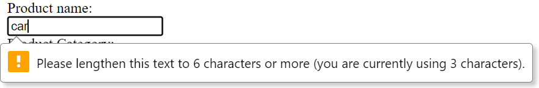
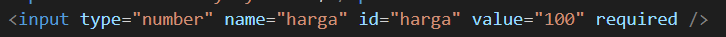
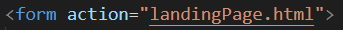

# Summary HTML

1. HTML atau Hypertext Markup Language, merupakan sebuah standar yang digunakan secara luas untuk menampilkan halaman web.
2. Beberapa kegunaan dari HTML diantaranya adalah

- Membuat struktur dari halaman website.
- Mengatur tampilan dan isi dari halaman website.
- Membuat tabel dengan tag HTML table.
- Membuat form HTML.
- Membuat gambar dengan canvas.
- Mempublikasikan halaman website secara online.

3. Pendefinisian bahasa HTML menggunakan tag, beberapa tag tersebut seperti <!DOCTYPE html>, <html>, <head>, <body>.

source= Materi PPT by Alterra Academy

# Soal Prioritas 1

# Soal Prioritas 2

# Soal Eksplorasi

- Melakukan validasi required pada setiap form

- Produc Name minimal 6 huruf dan maksimal 50 huruf

- Product Price harus berupa angka

- Sambungkan halaman landingPage.html dengan CreateAccount.html

