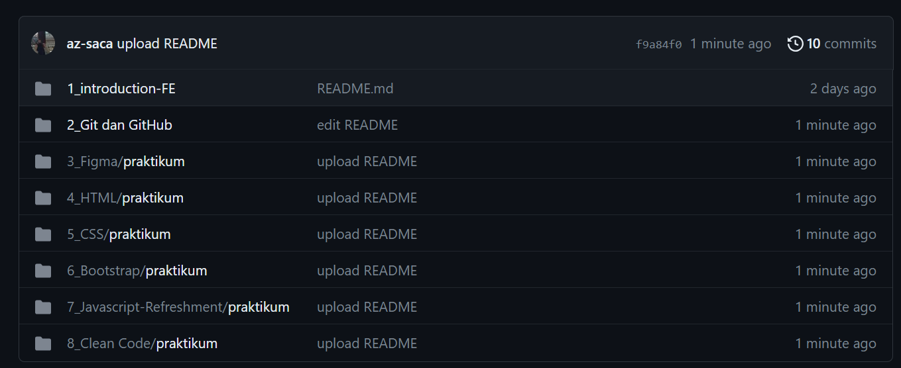
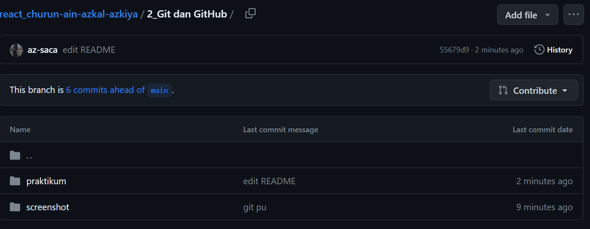
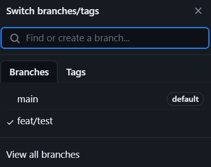
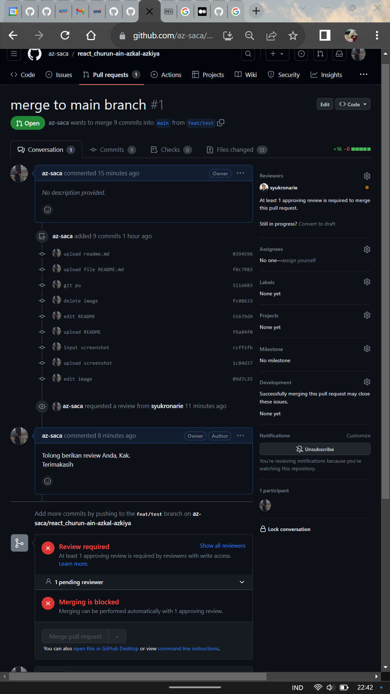

# Summary
- Git merupakan sebuah VCS yang terdistribusi untuk mengelola perubahan file di dalam sebuah folder.
- Beberapa istilah dalam Git maupun GitHub antara lain:
  1. repository : folder projek
  2. commit : rekaman dari repository
  3. hash : penanda unik pada sebuah commit
  4. checkout : keyword untuk berpindah commit/ branch
  5. branch : cabang bebas dari sebuah commit
  6. merge : menggabungkan sebuah branch
  7. clone : mengambil repository dari cloud ke lokal
  8. push : mengirimkan commit ke repository
  9. pull : mengambil commit dari repository
  10. diff : membandingkan perubahan pada commit yang terakhir
- Manfaat dari penggunaan Git dan GitHub adalah untuk mempermudah developer dalam melakukan kolaborasi. Selain itu, dengan menggunakan Git dan GitHub, developer dapat melacak waktu perubahan yang terjadi dan pelakunya.

# Soal Prioritas 1

1. Buatlah sebuah repository github yang sesuai dengan namaKelas_namaKlaian.
   

2. Buatlah folder yang berurutan dan diberi nama sesuai dengan nama soal yang kalian kerjakan.
   

3. Pada setiap folder akan berisikan sub folder lagi
   

# Soal Prioritas 2

1. Buatlah branch baru pada github yang kalian buat
   
   

3. Lakukan Pull Request pada branch tersebut sehingga akan menambah hal baru pada branch
   
   
