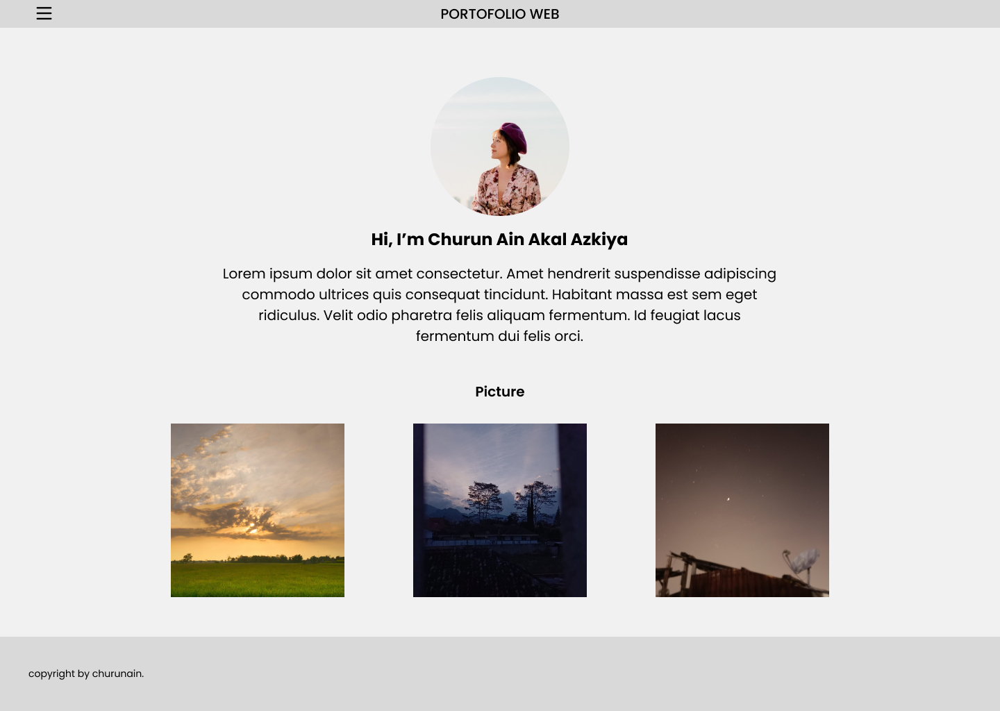
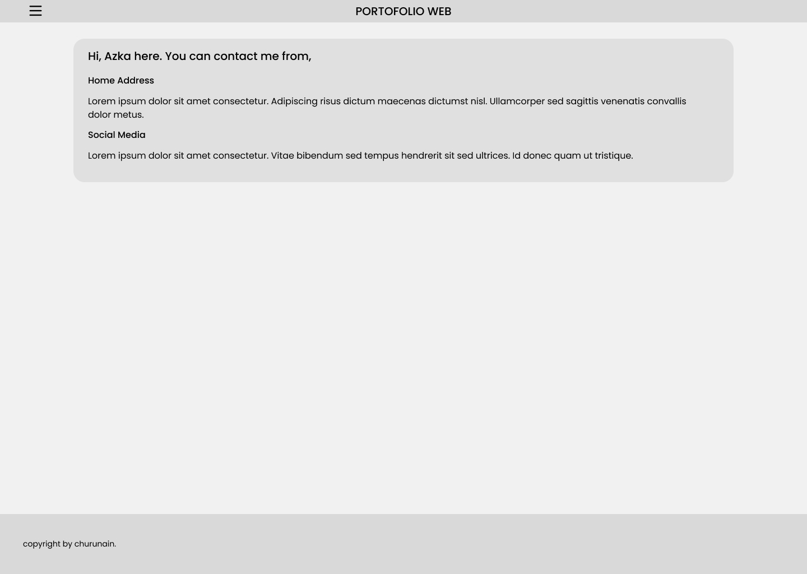
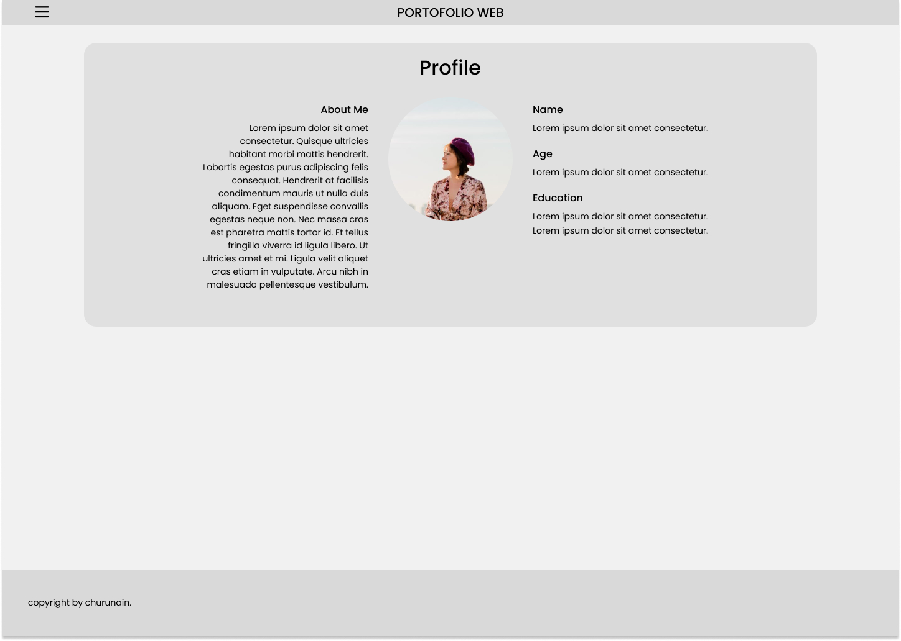

# Summary Figma

1. Figma merupakan sebuah editor grafik vektor dan alat prototyping dengan basis web. Figma dapat digunakan untuk mendesain mockup, mendesain tampilan UI, dan wireframe.
2. Keunggulan penggunaan Figma adalah:
   - gratis,
   - dapat dijalankan di Mac maupun PC,
   - dapat digunakan untuk kolaborasi secara real-time,
   - bisa digunakan untuk prototyping.
3. Sedangkan, kekurangannya ialah penggunaan Figma hanya bisa dilakukan secara online dikarenakan berbasis website.

# Membuat Desain Figma

- Home

- Contact

- About

[Link-Prototyping](https://www.figma.com/proto/fdd4UVIUBjDtXWBkU5NQm7/porto-web-SIB?type=design&node-id=3-3&t=ge6FzcvDw0REUfFh-1&scaling=min-zoom&page-id=0%3A1&starting-point-node-id=3%3A3&show-proto-sidebar=1&mode=design)
